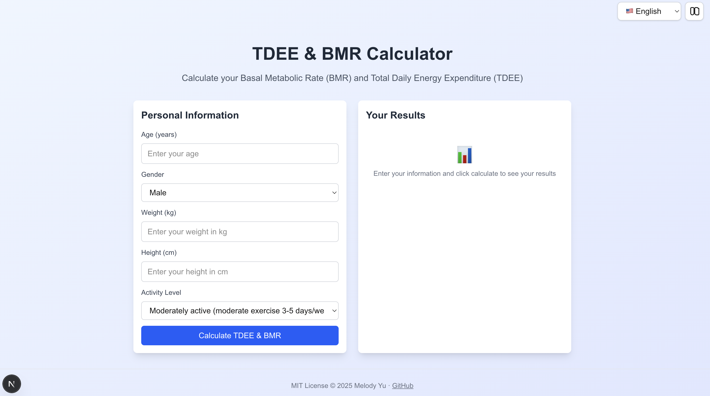

# [TDEE & BMR Calculator](https://github.com/Melodieeee/calories-calc)

A modern React application for calculating Total Daily Energy Expenditure (TDEE) and Basal Metabolic Rate (BMR) using the Mifflin-St Jeor equation.

See Demo here: https://calories-calc.vercel.app/

## Features

- **BMR Calculation**: Calculate your Basal Metabolic Rate using the Mifflin-St Jeor equation
- **TDEE Calculation**: Determine your Total Daily Energy Expenditure based on activity level
- **Weight Management**: Get calorie recommendations for weight loss and weight gain
- **Responsive Design**: Works seamlessly on desktop and mobile devices
- **Modern UI**: Clean, intuitive interface built with Tailwind CSS

## Screenshot



*The TDEE & BMR Calculator app with a modern, responsive layout and always-visible footer.*

## Technologies Used

- **React 19** with TypeScript
- **Next.js 15** with App Router
- **Tailwind CSS** for styling
- **Mifflin-St Jeor Equation** for accurate BMR calculations

## Getting Started

### Prerequisites

- Node.js 18+ 
- npm or yarn

### Installation

1. Clone the repository:
```bash
git clone <repository-url>
cd calories-calc
```

2. Install dependencies:
```bash
npm install
```

3. Run the development server:
```bash
npm run dev
```

4. Open [http://localhost:3000](http://localhost:3000) in your browser.

## How It Works

### BMR Calculation (Mifflin-St Jeor Equation)

The Basal Metabolic Rate is calculated using the Mifflin-St Jeor equation:

- **For Males**: BMR = (10 × weight) + (6.25 × height) - (5 × age) + 5
- **For Females**: BMR = (10 × weight) + (6.25 × height) - (5 × age) - 161

Where:
- Weight is in kilograms (kg)
- Height is in centimeters (cm)
- Age is in years

### TDEE Calculation

Total Daily Energy Expenditure is calculated by multiplying BMR by an activity multiplier:

- **Sedentary** (little or no exercise): BMR × 1.2
- **Lightly Active** (light exercise 1-3 days/week): BMR × 1.375
- **Moderately Active** (moderate exercise 3-5 days/week): BMR × 1.55
- **Very Active** (hard exercise 6-7 days/week): BMR × 1.725
- **Extra Active** (very hard exercise, physical job): BMR × 1.9

### Weight Management

- **Weight Loss**: TDEE - 500 calories (creates a 500 calorie deficit)
- **Weight Gain**: TDEE + 500 calories (creates a 500 calorie surplus)

## Project Structure

```
src/
├── app/
│   ├── layout.tsx          # Root layout component
│   ├── page.tsx            # Main page component
│   └── globals.css         # Global styles
├── components/
│   └── CalorieCalculator.tsx  # Main calculator component
└── utils/
    └── calculations.ts     # BMR and TDEE calculation functions
```

## Usage

1. Enter your personal information:
   - Age (years)
   - Gender (male/female)
   - Weight (kg)
   - Height (cm)
   - Activity level

2. Click "Calculate TDEE & BMR" to see your results

3. View your calculated values:
   - **BMR**: Calories burned at rest
   - **TDEE**: Total daily calories burned
   - **Weight Loss**: Recommended calories for weight loss
   - **Weight Gain**: Recommended calories for weight gain

## Contributing

1. Fork the repository
2. Create a feature branch
3. Make your changes
4. Submit a pull request

## License

This project is open source and available under the [MIT License](LICENSE).

## Disclaimer

This calculator provides estimates based on widely accepted formulas. Individual results may vary, and it's recommended to consult with healthcare professionals for personalized nutrition advice.
